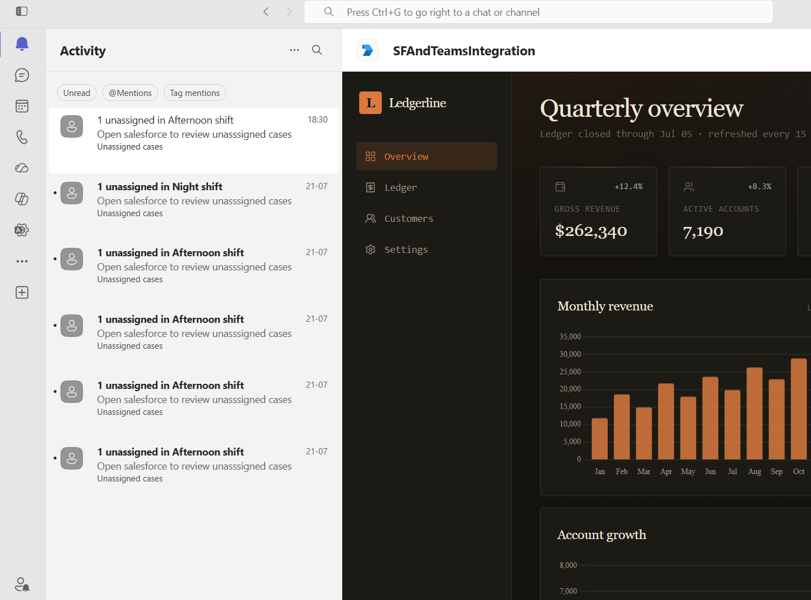
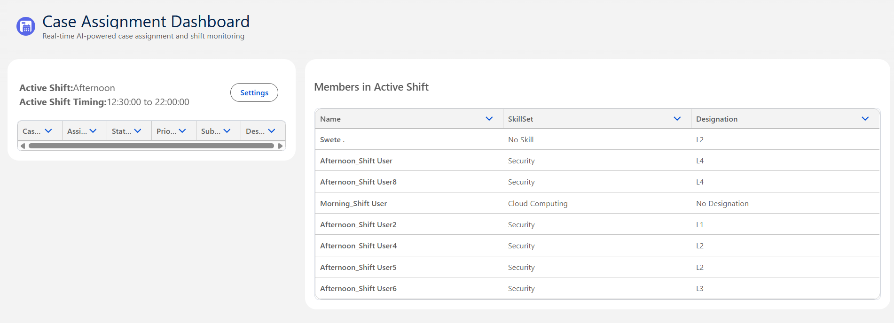

# Automated AI-Based Case Triaging & Assignment Assistant

## 🚀 Overview

**Automated AI-Based Case Triaging & Assignment Assistant** is a Salesforce-based intelligent support platform that automates **Case classification, skill-based routing, shift-aware assignment, and operational notifications**.

The system combines **Salesforce automation, Claude AI, Queueable Apex, persistent round-robin assignment, and Microsoft Teams integration** to streamline the Case assignment process.

## 🔄 Solution Architecture

```text
Case Created
     │
     ▼
Queueable Apex
     │
     ▼
Claude AI Classification
     │
     ▼
Skill + Complexity Triage
     │
     ▼
Identify Active Shift Members
     │
     ▼
Eligible Members Found?
     │
     ├────────────── YES ──────────────┐
     │                                ▼
     │                    Persistent Round-Robin
     │                                │
     │                                ▼
     │                         Assign Case
     │
     └────────────── NO ───────────────┐
                                      ▼
                             Salesforce Notification
                                      +
                             Microsoft Teams Notification
                                      │
                                      ▼
                                Support Admin
```
### Assignment Flow

1. **Case Created**  
   A new Case enters the Salesforce system.

2. **Queueable Apex**  
   The classification and routing process executes asynchronously using Queueable Apex.

3. **Claude AI Classification**  
   Claude analyzes the Case and determines:
   - **Required Skill**
   - **Complexity**
   - **Confidence**

4. **Active Shift Members**  
   Salesforce identifies Shift Members who are currently available in the active shift.

5. **Eligibility Check**  
   Salesforce determines whether members matching the required skill and routing criteria are available.

6. **Persistent Round-Robin Assignment**  
   If eligible members are available, Salesforce assigns the Case using persistent round-robin logic.

7. **Fallback Handling**  
   If no eligible member is available:
   - Salesforce generates a notification.
   - Microsoft Teams sends a notification to the Support Admin.
   - The Support Admin manually monitors and handles the Case.

---

## ✨ Key Features

- **Skill & Complexity-Based Routing**  
  Uses **Claude AI** to classify each support Case based on the required **skill and complexity**, while Salesforce remains responsible for the routing decision.

- **Asynchronous AI Classification & Routing**  
  The complete **classification and assignment workflow is executed asynchronously using Queueable Apex**, including the Claude callout, AI response processing, eligible Shift Member identification, and round-robin assignment.

- **Persistent Round-Robin Assignment**  
  Automatically distributes Cases fairly among eligible Shift Members while maintaining routing state across transactions.

- **Shift-Aware Assignment**  
  Considers the **active shift and available Shift Members** before assigning a Case.

- **No-Member Fallback Handling**  
  Prevents incorrect assignment when no eligible Shift Member is available and initiates a fallback process for **Support Admin intervention**.

- **Salesforce + Microsoft Teams Notifications**  
  Notifies the Support Admin through **Salesforce and Microsoft Teams** when automatic assignment cannot be completed.

- **Secure Integration Architecture**  
  Uses **Named Credentials, External Credentials, and Named Principal authentication** instead of hard-coded credentials.
  
  - **Salesforce → Claude:** Uses **API Key authentication**.
  - **Salesforce → Microsoft Teams:** Uses **OAuth 2.0 Client Credentials flow with Client Secret authentication**.
  - Authentication credentials remain outside Apex code for improved **security, maintainability, and centralized credential management**.

- **Data Modeling & Relationships**  
  Implements a structured Salesforce data model using:
  - **One-to-One relationships**
  - **One-to-Many relationships**
  - **Many-to-Many relationships**
  - **Junction objects** for Many-to-Many associations
  
  These relationships model business entities such as **Shifts, Shift Members, Skills, and Designations**, supporting flexible and scalable routing logic.

- **Operations Dashboard**  
  Provides operational visibility through a custom **Lightning Web Component (LWC)** built using **Salesforce Lightning Design System (SLDS)**.
  
  The dashboard provides visibility into:
  - **Active Shift**
  - **Shift Timing**
  - **Cases**
  - **Assignment**
  - **Status**
  - **Priority**
  - **Subject**
  - **Description**
  - **Active Shift Members**
  - **Skills**
  - **Designations**

---

## 🔐 Security

The project follows **Salesforce security and integration best practices**:

- **`with sharing`** where appropriate
- **Object-level permissions**
- **Field-level security (FLS)**
- **Controlled Experience Cloud guest access**
- **OAuth-based authentication**
- **Named Credentials**
- **External Credentials**
- **Named Principal authentication**
- **No hard-coded API secrets**
- **Dedicated integration authentication**


### 🌐 Experience Cloud

markdown
## 🌐 Experience Cloud

The application is exposed through a **Salesforce Experience Cloud site**.

## 🚀 Live Demo

[**Open the Automated Case Assignment Dashboard**](https://orgfarm-7ae634c288-dev-ed.develop.my.site.com/AutomatedCaseAssignment2)

> **Note:** The demo runs on a Salesforce Developer/Org Farm environment, so availability may depend on the org and Experience Cloud site being active.

## 📸 Screenshots

### Microsoft Teams Notification

The Microsoft Teams integration notifies the Support Admin when a Case cannot be automatically assigned because no eligible Shift Member is available.



### Operations Dashboard

The Operations Dashboard provides visibility into the active shift, shift timing, Cases, assignments, and active Shift Members with their associated skills and designations.


